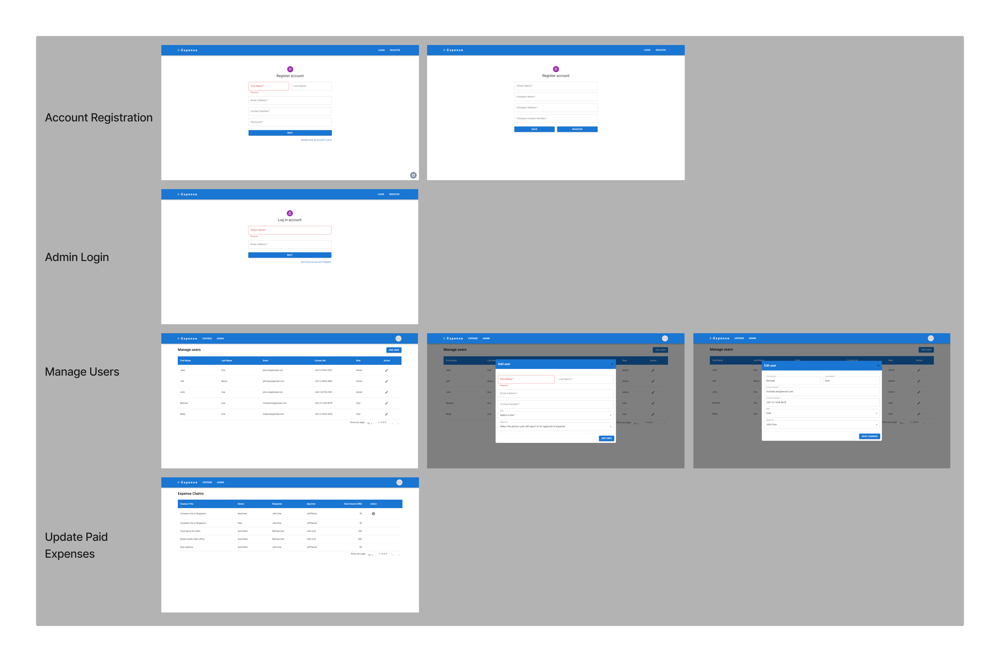

# i-Expense
## Introduction/Overview
The idea for this project is derived from the concept of SaaS based applications (i.e. Coupa). It is a multi tenant expense claim solution, where registered users/employees of a company can log into the system to submit their expense claims for approval and processing. This application was created within 5 days as part of my GA final project.

The application is split into two parts: (1) web, and (2) mobile. The web part is for business admins while the mobile part are for expense claim submission and approval. The mobile part of the application is built using Expo.

Features of web part of the application:
* Register an account
* Maintain users/employees of the company who will be using the application
* Mark expense claims as paid



Features of mobile part of the application:
* Login for user
* Create, edit and delete expenses
* Create, edit and delete expense items
* Save and submit expenses
* View, approve, and reject submitted expenses


## Getting Started
### Prerequisite
Make sure that you have Node.js installed together with a package manager like npm or yarn.
Apart from that you'll also need to have a mongoDB account and cluster. You can register for free on [mongodb.com](https://www.mongodb.com/)

### Installation
```bash
# Clone repository
$ git clone https://github.com/jgoh88/i-Expense.git
```
Web frontend + backend
```bash
# Install dependencies
$ cd i-Expense/backend
$ npm install   # or yarn install

# Setup environment variables
# Create a .env file with the required variables. Refer to .env_sample in backend folder

$ node index    # or nodemon index if you have nodemon installed. This will start the application
```
Mobile frontend
```bash
# Install dependencies
$ cd ../frontend_mobile
$ npm install   # or yarn install

# Setup connection to backend
# Open axiosBackend.js (in src/configs), change the baseURL to 'http://localhost:< YOUR PORT >/api'

$ expo start     # or npm start also works. This will start the application
```

## Demo
For demo of the application, you can refer [here](https://i-expense.onrender.com).  
This is only for the web part, you'll still need to follow the installation steps for demo on the mobile application part, with the only exception that you can skip the step to change the baseURL in axiosBackend.js.
